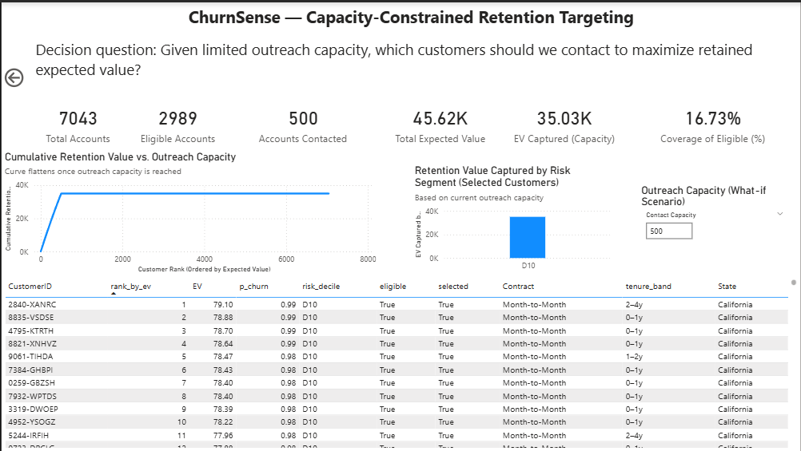
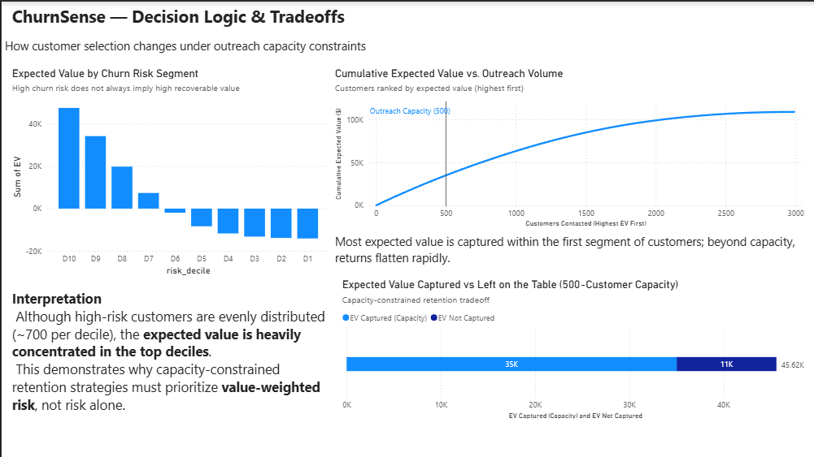

# ChurnSense — Capacity-Constrained Retention Targeting

> **Decision-support system for customer retention under real-world operational constraints.**  
> Optimizes which customers to contact when outreach capacity is limited by maximizing **expected retained value**, not just churn risk.

---

## Executive Summary

Most churn models stop at prediction.  
**ChurnSense goes further** — translating churn risk into **actionable, capacity-aware decisions** for Customer Experience and Success teams.

Instead of asking *“Who is most likely to churn?”*, this project answers:

> **“Given limited outreach capacity, which customers should we contact to maximize retained value?”**

The result is a decision framework that aligns analytics with operational reality.

---

## Business Problem

Customer Success and CX teams face **hard constraints**:
- Limited agent capacity
- Fixed outreach budgets
- Time-bound intervention windows

Traditional churn models rank customers by **risk alone**, which often:
- Over-prioritizes low-value accounts
- Misallocates scarce outreach resources
- Fails to maximize ROI per contact

---

## Business Question

> **Given limited outreach capacity, which customers should be contacted to maximize retained expected value?**

This reframes churn from a **prediction problem** into a **decision optimization problem**.

---

## Data

**Dataset:** Telco Customer Churn  
**Source:** Kaggle  
https://www.kaggle.com/datasets/rhonarosecortez/telco-customer-churn

**Description:**
- 7,043 customer records
- Contract type, tenure, services, payment method
- Monthly charges and churn outcomes

**Why this data works:**
- Realistic CX / subscription business structure
- Supports risk modeling *and* value-based decisioning
- Commonly used in industry, easy to contextualize for interviews

---

## Analytical Approach

### 1. Churn Risk Modeling
- Trained a baseline churn classifier
- Generated individual **churn probabilities (`p_churn`)**

### 2. Expected Value (EV) Framework
For each customer:

Expected Value = p_churn × customer_value

This converts raw risk into **recoverable value**.

### 3. Capacity-Constrained Selection
- Customers ranked by **Expected Value**
- Outreach simulated under a fixed capacity (e.g., 500 customers)
- Customers selected until capacity is reached

---

## Decision Framework

ChurnSense formalizes retention targeting as:

> **Value-weighted prioritization under operational constraints**

This allows CX leaders to:
- See marginal returns of additional outreach
- Understand tradeoffs between risk, value, and capacity
- Justify decisions with transparent metrics

---

## Dashboard Walkthrough (Power BI)

### Page 1 — Capacity-Constrained Retention Targeting

**What this shows:**
- Total accounts vs. eligible accounts
- Fixed outreach capacity (what-if)
- Total expected retention value
- EV captured within capacity
- Coverage of eligible population

**Key takeaway:**  
A relatively small subset of customers captures a disproportionate share of retention value.

---

### Page 2 — Decision Logic & Tradeoffs

#### Expected Value by Churn Risk Decile
- Customers evenly distributed across risk deciles
- **Value is heavily concentrated in top EV deciles**

#### Cumulative Expected Value vs. Outreach Volume
- Customers ranked by EV (highest first)
- Vertical line marks outreach capacity
- **Diminishing returns beyond capacity**

#### EV Captured vs. Left on the Table
- Clear visualization of:
  - Value captured within capacity
  - Value forfeited due to constraints

---

## Key Insights

- **Expected value is not evenly distributed**, even when risk is
- **Risk-only targeting misallocates scarce outreach capacity**
- **Most retention value is captured early**
- Marginal returns flatten rapidly beyond optimal capacity
- Analytics must align with **operational constraints**, not just model accuracy

---

## Business Impact

This framework enables CX and Customer Success teams to:

- Treat customer outreach as a **data product**
- Maximize ROI per contact under fixed capacity
- Make defensible, transparent prioritization decisions
- Communicate tradeoffs clearly to executives and stakeholders

---

## Tech Stack

- **Python** — modeling, feature engineering
- **scikit-learn** — baseline churn model
- **Pandas / NumPy** — data processing
- **Power BI** — decision dashboards & what-if analysis
- **GitHub** — version control and documentation

---

## Repository Structure

churnsense/
├── data/
│ ├── raw/ # Original Kaggle dataset
│ └── processed/ # Feature-engineered data
├── notebooks/
│ ├── 01_eda_and_data_quality.ipynb
│ ├── 02_baseline_modeling.ipynb
│ ├── 03_feature_engineering.ipynb
│ └── 04_decision_policy_simulation.ipynb
├── models/
│ └── baseline_logreg.joblib
├── images/
│ ├── image.png # Dashboard page 1
│ └── image-1.png # Dashboard page 2
├── README.md
└── requirements.txt

---

## Why This Project Matters

ChurnSense demonstrates the difference between:
- **Predictive analytics** and **decision analytics**
- **Model performance** and **business impact**

It reflects how real CX, BI, and Decision Science teams operate:
> Analytics exists to **inform action under constraints**, not just generate scores.

---

## Next Extensions

- Profit-aware retention modeling
- Channel-specific intervention costs
- SLA-aware outreach optimization
- Integration with SupportOps (ticket-based prioritization)

---

**Author:** Brandon Theard  
**Focus:** Decision Support • Business Intelligence • Customer Analytics
